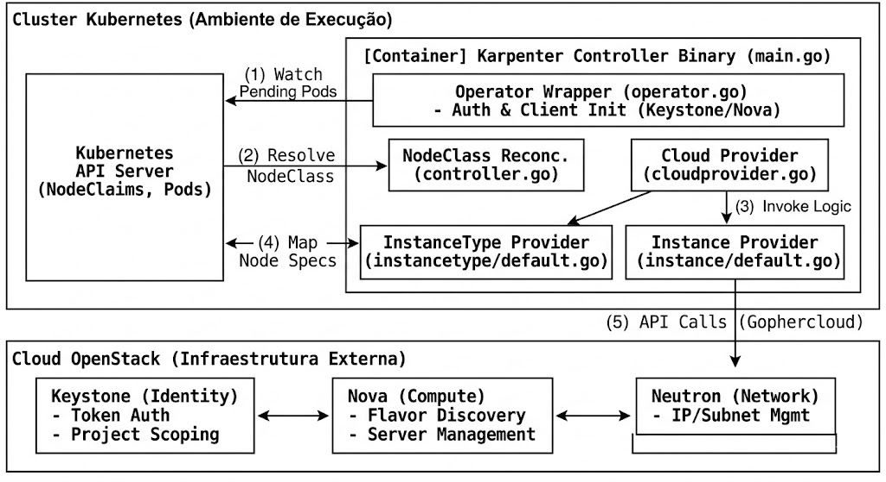

# Karpenter Provider for OpenStack

This repository contains the implementation of a **Karpenter** provider for the **OpenStack** cloud platform. The goal of this project is to enable dynamic and efficient autoscaling for Kubernetes clusters running on OpenStack infrastructure, eliminating the dependency on static Node Groups and optimizing resource utilization through *just-in-time* provisioning.

This project was developed as a Final Course Project (TCC) at the **Federal University of Campina Grande (UFCG)**.

---

## 🚀 About the Project

Karpenter is a next-generation autoscaler that watches for "Pending" pods and provisions nodes directly in the cloud infrastructure. While established implementations exist for AWS, Azure, and GCP, this project fills the gap for the **OpenStack** ecosystem by utilizing the **Adapter Pattern** to integrate Kubernetes APIs with IaaS services.

[Image of Karpenter architecture workflow showing pending pods leading to node provision]

### Key Features
* **Node Group-less Provisioning:** Creates instances on-demand with the exact specifications required by the workload.
* **Intelligent Flavor Selection:** Maps CPU/RAM requirements to the most cost-effective *Flavor* in the OpenStack catalog.
* **Modular Architecture:** Written in Go, leveraging the **Gophercloud** SDK for interaction with Nova (Compute), Neutron (Networking), and Keystone (Identity) services.

## 🏗️ Architecture and Workflow

The provider acts as a bridge between the Karpenter controller and the OpenStack API. The workflow follows these steps:

### Workflow Steps (as shown in the diagram):
1. **Watch Pending Pods:** The Karpenter Core monitors the Kubernetes API Server for pods that cannot be scheduled due to lack of resources.
2. **Resolve NodeClass:** The controller identifies the associated `OpenStackNodeClass` to understand the infrastructure constraints (image, network, security groups).
3. **Invoke Logic:** The `CloudProvider` implementation triggers the internal logic to determine the best scaling action.
4. **Map Node Specs:** The `InstanceTypeProvider` queries the OpenStack flavors and maps their hardware specs (CPU, RAM) back to Kubernetes requirements.
5. **API Calls (Gophercloud):** The `InstanceProvider` executes the final provisioning requests to OpenStack services (Nova/Neutron) to launch the new virtual machine.
[Image of OpenStack logical architecture showing Nova, Neutron and Keystone services]

## 🛠️ Tech Stack

* **Language:** [Go (Golang)](https://go.dev/)
* **OpenStack SDK:** [Gophercloud](https://github.com/gophercloud/gophercloud)
* **Orchestration:** [Kubernetes](https://kubernetes.io/)

## 📖 Deploy

👉 **[Development & Deployment Guide](deploy/local/README.md)**
*Learn how to configure OpenStack credentials, install CRDs, and run the controller locally.*
